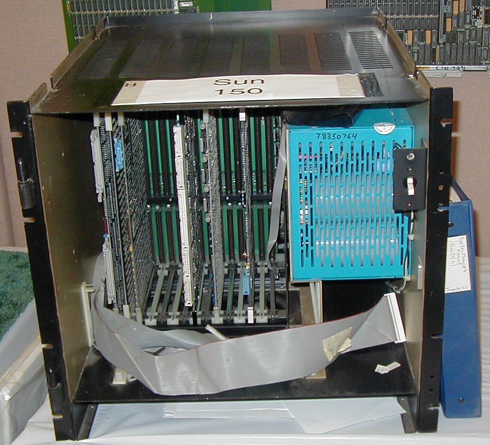

# Chapter 1: Beginnings 初创

如同莫扎特或格什温的音乐天才一样，创业能力往往在很早的年龄就显现出来。在印度新德里，少年Vinod Khosla就已经知道他想要创办自己的公司。拥有印度理工学院的电气工程学位，热情洋溢的Khosla在祖国的初创公司失败后，来到了美国。他在匹兹堡的卡内基梅隆大学获得了生物医学工程硕士学位，然后西行前往加利福尼亚州帕洛阿尔托的斯坦福大学MBA项目。这是在20世纪70年代末，刚刚被称为“硅谷”的地方正成为创业者的圣地。苹果公司的两位创始人在车库里开发了第一台真正的个人计算机，而英特尔则刚刚发明了微处理器。斯坦福大学和附近的加州大学伯克利分校提供了计算机实验室，无数学生在这里磨练技能，实现他们的梦想。

Khosla于1980年从斯坦福毕业后，写了400封信给符合他标准的公司：成立不超过三年、员工不超过一百人。他已经展示了那种近乎狂热的决心和对细节的关注，这些品质为他的成功铺平了道路，也为他的失败埋下了伏笔。这400封信没有一封有回音，但在斯坦福的一次联系证明是有成效的，1980年初，他帮助创办了专门从事计算机辅助设计（CAD）的Daisy Systems。虽然Daisy最终在一个有希望的开端后倒闭了，但在那一年半的时间里，Khosla获得了创办Sun的动力。在Daisy，他在寻找一台更好的计算机来处理CAD。当时的主流模式要求工程师轮流使用一台大型的小型计算机。很少有人认为给每个工程师配备一台足够强大的计算机来处理CAD或CAM（计算机辅助制造）是可行的，但Khosla认识到，解决方案可能在于新的工作站，一种相对便宜但能够处理以前由小型计算机完成的复杂任务的个人计算机。Khosla还希望工作站能连接到一种他在斯坦福看到的网络，称为以太网，它可以让工程师进行电子协作。这在当时是一个革命性的概念。

1981年，发生了一次硅谷传奇中的那些幸运邂逅之一：一位秘书把Khosla与一名研究生联系起来，这名研究生正在做一个叫做斯坦福大学网络（SUN）的项目。这位同样是移民的研究生叫Andy Bechtolsheim，一个高大、金发、内向的德国人，他的外貌和举止与Khosla形成了鲜明对比。他们用不同口音的英语交流，但Khosla很快意识到，Bechtolsheim拥有实现他工作站愿景所需的技术。Bechtolsheim的野心更为温和：他正以每个1万美元的价格向本地公司授权他的设计。对于他完成博士学位来说，这似乎是一笔不错的生意。但Khosla直接告诉他：“我想要的是下金蛋的鹅。”Bechtolsheim最终没有获得博士学位。他和Khosla写了一份简短的六页商业计划书，概述了他们将如何构建和销售SUN工作站。该计划书标注的日期是1982年2月12日，列出了十几家竞争对手，从小型计算机制造商如Digital Equipment、Data General和惠普，到个人计算机供应商如苹果和Tandy。工作站的价格从25,000美元到100,000美元不等，比小型计算机更小、更便宜、更灵活，但比个人计算机更强大。另一个初创公司，马萨诸塞州切姆斯福德的Apollo Computer，成立仅两年，已经证明了工作站市场的存在。（当时，微软是位于华盛顿州雷德蒙德的一个不知名的个人计算机软件供应商，尚未进入Sun的雷达范围，尽管它已经与IBM达成了一项关键的协议，为其个人计算机提供操作系统。在接下来的十年里，Sun和微软将沿着平行的轨迹发展，远程关注对方的存在。）

Sun的基础理念是开放系统和网络。其主要竞争对手Apollo开发了一种优雅的硬件-软件组合，但这两个元素都是专有的，即它们是Apollo独有的，完全由其控制。相比之下，Sun打算使用标准化组件。作为操作系统，它将使用由AT\&T开发并广泛授权给大学、研究实验室和公司的Unix。Sun的硬件基于Motorola的半导体，任何想购买的人都可以获得。增值部分在于Bechtolsheim如何将这些芯片组合在Sun工作站的核心中。使用现成的组件，而不是从头开始构建，使Sun能够将其机器定价为竞争对手的一半以下。根据商业计划书，Sun的机器最终用户价格将在10,000美元到20,000美元之间，而Apollo最便宜的机器售价为25,000美元。

在网络方面，以太网连接将允许潜在用户交换电子消息和共享文件存储和打印等服务。Khosla说：“对我来说，愿景是分布式计算。”由于以太网允许用户共享信息，“你不需要所有的计算能力都在同一个地方。技术改变了计算机的经济学。”虽然今天几乎每个计算机制造商都在宣传开放系统和网络概念，但在20世纪80年代初，这些概念还是新的。像IBM和惠普这样的领先计算机制造商各自提供不同的专有技术，不能互操作。客户被迫做出选择并坚持下去，除非他们愿意放弃所有昂贵的机器并重新开始。Sun的技术更快地组合在一起，就像福特装配线取代手工制造汽车一样，因此更能适应市场变化。

## 需要资金

在Khosla和Bechtolsheim能够启动公司之前，他们需要资金。在20世纪80年代初，硅谷的风险投资社区还没有完全发展起来。今天，有抱负的企业家在开始向各个风险投资公司展示之前，必须有一个复杂、多方面的商业计划和口头陈述，就像选美比赛的参赛者一样。在1982年，风险投资界规模较小且更为非正式。带着他们的六页商业计划书，以及他们在斯坦福大学运行的产品的可操作模型，Khosla和Bechtolsheim与资深工程师转投资者的Bob Sackman会面，Khosla在Daisy Systems时认识他。在硅谷，准企业家们会培养一个知识渊博的联系人网络，他们可以一再求助。拥有30年电子行业经验的Sackman是加利福尼亚州门洛帕克的美国风险投资伙伴公司的联合创始人。会议上的另一位潜在投资者是代表门洛帕克西海岸风险投资公司的Doug Broyles。在五天内，这两位风险投资家开出了总额为284,000美元的支票，资助这家年轻的公司。Khosla在1989年对哈佛商学院教授Amar Bhide的一项案例研究中表示：“这真的是基于信任，他们几乎没有进行尽职调查——他们只是相信这个概念。”

吸引Sackman投资的商业计划书简短、简单，也许有些天真，但它反映了Sun将会坚持的品质。计划书中的任务是“开发、制造、营销和支持用于CAD/CAM市场的图形工作站……以市场上最好的性价比产品保持领先地位。”计算机辅助设计为飞机到芯片等产品创建蓝图，是一个需求技术卓越的工程师市场，他们不介意冒险选择能提供此类技术的新公司。虽然Sun的市场已经扩展到企业信息管理者，但公司从未失去对其产品在技术上的领导地位，而不仅仅是使用其他地方的技术进行集成或提供解决方案。问Sun的任何一位高管如何定义公司，他们首先会描述它作为一个控制其知识产权的产品公司。

Khosla和Bechtolsheim的两年初步预测表明，Sun在其第一个完整运营年度（1983财年）将实现总销售额400万美元，在第二年将实现1000万美元。此外，他们预计“到第一年结束时，公司将实现现金流收支平衡。”事实上，公司在第一个财年实现了860万美元的销售额，在第二年实现了3900万美元的销售额。首年营业收入为588,000美元，第二年为370万美元。尽管在其他方面名声大噪，Sun一直是一家管理严密、能实现其财务目标的公司。在17年中，Sun只有一个季度亏损，即1989年，这是公司发展的一个重要转折点。更多详情见第五章。

由于Bechtolsheim在斯坦福的工作，Sun在科学/技术界已经有了一定知名度，这将成为口碑推荐的基础。最初的商业计划书指出：“SUN工作站已经被科学界评审并认可。实际上，在没有任何主动营销的情况下，已经收到了数百个查询。”Sun的创始人偶然发现了一个支持者社区，他们不仅会购买Sun的技术，还会帮助其发展。没有任何一个硬件或软件供应商，无论其规模多大或多么强大，能够在没有这种外部支持网络的情况下生存。这种网络包括客户，他们的需求决定了技术的发展方向，以及为其编写程序的软件开发人员。通过首先针对技术计算机用户，Sun获得了进入这些通常独立做出技术决策的复杂买家的机会。这并不是一种新策略：竞争对手Apollo、Digital Equipment和惠普都曾使用过；然而，Sun将其推向极致，成为一个由工程师销售给其他工程师的公司。Sun因此与其客户建立了一种友谊关系，客户通过热情的反馈推动了销售。这种早期模式为公司提供了一个稳固的基础。

## 人员到位

拥有了种子资本，Khosla和Bechtolsheim现在可以转向他们初创公司的人员问题。Khosla想到了他在斯坦福认识的一个朋友，他当时在圣何塞的另一家Unix初创公司Onyx Systems负责运营。这位朋友就是Scott McNealy，他在美国汽车公司担任高管的父亲的帮助下在底特律郊区长大，在大学里以爱开派对的运动员闻名。尽管他就读于哈佛和斯坦福，McNealy在学术上并不出色。即使是今天，他也会告诉你他主修的是“啤酒和高尔夫”。他那灿烂的笑容和自嘲的态度让他在大学朋友中深受欢迎，包括Khosla。

在Sackman承诺投资后，Khosla带McNealy去当地的麦当劳庆祝，这既符合Khosla的钱包，也迎合了McNealy对快餐的喜爱。Khosla对他的朋友说：“那么你什么时候辞职？”McNealy回答说：“你还没有给我提供工作。”Khosla有点慌了，担心McNealy会打破他们一起工作的梦想。然后McNealy，作为一个天生的笑话高手，告诉Khosla：“我会接受这份工作。”McNealy、Khosla和Bechtolsheim都是出生于20世纪50年代中期的婴儿潮一代。“我们是二十多岁的年轻人经营公司，”Bechtolsheim回忆道，“我们刚刚见面，但我们肯定有共同的创业激情。”

年轻、未婚且渴望冒险的McNealy以指定联合创始人和制造主管的身份加入Sun。Sun的一位投资者，Doug Broyles，也是Onyx的CEO。Broyles是在一个共同的朋友Bill Raduchel的建议下招聘McNealy到Onyx的。Raduchel在哈佛认识McNealy，现在为Onyx的客户工作。Raduchel对Broyles说：“Scott对计算机一无所知，但他是一个很好的运营人员。将来他会为某人赚很多钱。”很快成为Sun投资者并加入其董事会的Broyles对McNealy的精力和学习意愿印象深刻。“Scott在制造环境中长大，因为他曾在他父亲的公司工作过几个夏天，”Broyles回忆道。“我们让他担任运营总监，把制造和采购归他管理。几周内，Scott就赢得了工作了14年的制造人员的尊重，他们开始团队合作。Scott走到生产线前与人交谈。”McNealy与不同类型人交流的能力对于Sun来说至关重要，这家公司多年来吸引了众多才华横溢的人才，包括许多后来自己成为公司负责人的经理和工程师。

在接下来的三个月里，Khosla、Bechtolsheim和McNealy三人夜以继日地开发第一款产品Sun-1的原型，但他们对用作操作系统的Unix变种并不完全满意。幸运的是，旧金山湾对面是Unix的公认专家之一，伯克利加州大学的研究生Bill Joy。团队前去招募他。

Joy是一个头发蓬松、戴眼镜的天才，仍然喜欢穿上20世纪70年代和80年代伯克利的迷幻色彩。当他讨论技术时，通常会飘到极高的境界，远远超过所有人的理解。但Bechtolsheim与这位潜在的招募对象一见如故，对Joy印象深刻的是，Joy走到他正在使用的Digital VAX小型计算机前，随意将其关闭。Joy回忆道：“他震惊了，因为当时你不能随便关闭计算机。”Joy对操作系统进行的调整（一个名为伯克利Unix的版本，几乎由Joy独有）允许快速关机。Joy和其他三人年纪相仿，所以他分享了年轻人的乐观情绪。他也厌倦了在伯克利争夺空间和资源。在与三人共进晚餐时，他大部分时间在与同样热衷技术的Bechtolsheim谈论技术，Joy签署了成为第四位联合创始人的协议。Joy回忆道：“我说，‘见鬼去吧’，这些人看起来年轻又天真，但我在伯克利受挫，准备冒一次险。”

## 一个初创企业诞生了

关键人物现在都到位了，Sun可以打造成功的产品：Khosla具有野心和愿景，McNealy具有实际的制造和个人技能，Bechtolsheim和Joy具有技术专长。（McNealy和Joy仍在Sun工作，而Khosla现在在著名的风险投资公司Kleiner Perkins Caufield & Byers工作，Bechtolsheim是圣何塞Cisco Systems的工程副总裁。）作为驱动力，Khosla对现在称为Sun Microsystems Incorporated的公司有着宏大的雄心。（最初的名称SUN Workstation被认为过于狭窄而被放弃。）他说：“我是一个非常有竞争力的人，我不想建立一个小公司。有些公司一开始是零百万美元的公司，有些公司是零十亿美元的公司。Sun是一家零十亿美元的公司。”他喜欢用的比喻是，这家初创公司是一艘需要达到轨道速度的火箭。“月球或破产是我们的座右铭，”他说。与Khosla的紧张相比，McNealy更加轻松，开玩笑说Sun“将是最大的失败。”可以看出，他们各自风格的不同。Joy和Bechtolsheim则埋头专注于技术。

但Sun缺少的是一个能销售Joy和Bechtolsheim热衷设计的产品的人。Joy转向他在伯克利的一位年长、经验丰富的朋友John Gage，当时他在为有线公司做咨询。Gage，现在是Sun的首席科学家，“基本上在1983年卖出了所有的机器，”Joy说。他记得Gage如何将堆在他桌上的电话信息按时区分开。Gage“早上从欧洲开始，随着一天的进展，他会转到不同的时区。有时他会把所有东西重新堆回一堆，因为他没有足够的时间。”Gage补充道：“第一年所有的销售都是通过我打电话说‘你要多少’实现的。”Gage说，当他加入Sun时，McNealy和Khosla对商业世界有些无知。“Scott和Vinod试图通过挖掘Digital和Data General来招聘营销和销售副总裁——与有家庭和乡村俱乐部房屋的成熟人士交谈。”Gage讽刺道：“他们浪费了很多时间。”除了营销和销售，他还负责技术支持和回答所有外部电话。Gage接订单，Sun生产并发货。

Sun是典型的初创公司，混乱且无结构，但这些早期的经历形成了一些构建框架，这些框架将巩固并指导公司的发展。

第一个是公司运行精简高效，员工通常资源比竞争对手少得多，工作时间长。“我记得我妻子大约午夜打电话来问我什么时候回家，我说还要再几个小时。然后我在凌晨4点出现，”1985年至1991年的公司资源副总裁Crawford Beveridge回忆道。Khosla和McNealy都很节俭，尤其是Khosla。他通过观察市场上最小的可行参与者（除了Sun），即惠普，来计算他需要多少工程师。“惠普在销售工作站的部门有300名工程师，”Khosla回忆道。“我说我比惠普好一倍——我需要150名工程师。”他补充说，开放系统的概念允许Sun利用其他地方开发的创新，而不是仅仅依赖于专有的内部技术。

第二个构建是与产品无关的功能，如营销和客户支持，是临时处理的。它们是工程驱动的产品技术方面的事后的想法。随着它向上游移动，Sun将被迫修订这些优先事项，但它们在公司的很大一部分历史中是有效的。

第三个构建是McNealy是与员工交流和处理士气问题的人，这意味着他正在成为事实上的领导者，尽管他是制造副总裁而Khosla是CEO。但Khosla太过专注，Joy和Bechtolsheim埋头于技术，难以与人员和文化需求很好地相处。

<figure><figcaption></figcaption></figure>

## 首次危机

Sun在1982年底推出了其第一个真正的产品Sun-2。（Sun-1本质上是一个原型。）

| Model   | Chassis                      |
| ------- | ---------------------------- |
| Sun 100 | 7-slot Multibus (desktop)    |
| Sun 150 | 15-slot Multibus (rackmount) |

<figure><figcaption></figcaption></figure>

<figure><figcaption></figcaption></figure>

Sun-2结合了工程市场所寻找的元素：它运行Joy的伯克利Unix，这是当时最酷、最时髦的操作系统，搭载在Bechtolsheim设计的流线型硬件上。因此，它在当时很快且相对易于使用，因为大多数工程师都精通Unix。McNealy在1985年12月16日《计算机世界》的一篇观点文章中解释说：“为用户建立信心的最佳方式是围绕被行业广泛接受的标准设计产品，在这些标准上，一种技术需要与另一种技术进行交流。Unix就是这样一种可以被从超级计算机到桌面计算机共享的标准。”Sun-2还有一个用户优先级列表中很重要的东西：一个大19英寸显示器，可以提供领先的图形能力。

问题是，Sun-2的新显示器来自外部供应商，静电释放太多，可能会导致整个系统短路。产品支持的早期员工Dave Cardinal记得这个问题。在1983年的Comdex贸易展上，他被分配去为Sun的展位设置9台Sun-2机器进行产品演示。“我们打包了20台机器以确保有9台工作，”他回忆道。“整个卡车都是备用材料。”当有人尝试使用机器时，由于静电积累，它经常会重新启动。“前台的John Gage即兴发挥他的‘重启演讲’，而后台的我和其他Comdex小组成员拼命工作，试图让机器再次运行起来。”由于故障率太高，Sun不得不提供延长保修期，承诺更换显示器以安抚客户。

同年，Sun招聘了Bernie Lacroute，这位来自Digital、具有14年经验的法国移民，担任工程主管。他的第一个任务之一是解决显示器问题。“这是一个威胁生命的问题，”Lacroute回忆道。他发现显示器会通过连接电缆释放电力，击中机器。“就像闪电击中CPU（中央处理单元）板一样。”Sun无法立即找到另一家供应商，因此在此期间，Lacroute和他的团队尝试了一系列电缆，可能包含显示器的电释放。“每晚我们都会在制造车间的单位上试用新电缆，”Lacroute说。“我们知道必须更换显示器，但我们还是继续出货。如果我们不能出货，我们就完了。”Sun-2危机几乎花了一年的时间才真正解决干净。“我们最终雇佣了几名来自惠普的人，他们最终解决了问题，”Lacroute说。

Sun-2最终成为Sun的一个相对成功的产品，销售了数千台，并为推动公司达到十亿美元的地位奠定了基础。尽管存在问题，Sun-2使Sun得以开发出一种制造策略，快速制造机器以满足特定客户需求。“不惜一切代价发货”成为座右铭，这意味着四位创始人和公司的所有其他员工会在季度的最后一天聚集在制造车间，组装机器以便发货。最终，Sun-2是Sun用来达成一项关键交易的产品，这项交易迫使领先的工作站供应商注意到这个来自加利福尼亚的小公司。

## 应对Computervision

20世纪80年代初，总部位于马萨诸塞州贝德福德的Computervision是CAD市场上领先的完整系统供应商。1982年底，Computervision宣布将从依赖小型计算机转向更便宜的工作站，这些工作站现在足够强大，可以满足CAD的需求，这引发了一场工作站公司的混战。选择下来了：新来的Sun和老牌供应商Apollo，后者有一个额外的优势，就是在Computervision的后院。Sun用其新Sun-2工作站竞标，得到了Computervision工程师的赞赏，但最终Apollo赢得了合同。Khosla从Computervision的采购代理那里接到了坏消息。

在Sun老员工中被认为是传奇的一次行动中，Khosla和McNealy乘坐红眼航班从旧金山飞往波士顿，并未被邀请地出现在Computervision总部。他们在Computervision总部的豪华大厅里“种下自己”，从那里他们给Computervision内部的所有人打电话，要求再给一次机会，要求有机会修改他们的竞标。这是一个典型的“西海岸不惜一切代价”的方法与更为抛光、礼貌的“东海岸心态”之间的经典例子。Apollo和Computervision认为他们已经达成了交易；Computervision的工作人员试图把Khosla和McNealy赶出大厅。最后，一位Computervision的副总裁与Khosla和McNealy达成协议：离开大厅，Computervision总裁James Barret将打电话给你们在当地的销售办事处。

根据《Sunburst》的描述：“当电话打来时，Khosla知道这是他最后一次向Sun推销的机会。所以他全力推销。赢得Computervision……将向业界证明Sun的真实……”许多人回忆说，Sun几乎以成本价赠送了这些机器，但它赢得了与Computervision的三年、4000万美元的交易，这确立了公司的地位。Khosla为公司全体员工（当时有40人）举行了在旧金山湾上的庆祝游轮。Khosla强调，这笔交易的本质不是Computervision为工作站支付的价格，而是它还将制造和转售这些机器。Sun还有效地阻止了其最大的竞争对手Apollo达成可能确立其技术为CAD/CAM首选标准的交易。

后来加入Sun担任桌面系统总监的Todd Basche当时是Apollo的工程师，他回忆道：“我记得在Apollo的会议上，人们会嘲笑Sun，说‘那是一群在斯坦福的孩子’。”在Computervision交易之后，“他们改变了调子。”他补充道：“基本上，Sun为了达成交易卖掉了自己的灵魂。但我们不再嘲笑Sun。”Basche认为当时Apollo的机器比Sun的更可靠、更优越。Sun赢了，他说，有两个原因。首先，Apollo的传统管理团队对Sun的咄咄逼人、无礼的方式措手不及，不知道如何反应。Apollo的高管只能恼怒地指责对手不公平竞争。第二，Sun的工作站使用了Unix，而Unix在工程界正成为标准。这意味着培训时间减少，与同事的合作增强，他们可能已经熟悉Unix，但需要学习像Apollo这样的专有系统。如果Apollo愿意转向Unix，Basche认为“这将是另一个故事。”

因为销售量并不大，Computervision的交易对Sun来说并不是一个大赚钱的项目，但它在打开其他重大合同方面做了一些更重要的事情。例如，一年多后，Sun竞标了一份国家安全局的合同，该机构过去已经购买了Apollo的工作站。负责谈判的Gage回忆道：“我认为Sun可能会得到40%的合同，Apollo 60%。”但结果是“我们得到了100%。”国家安全局的交易强调了Sun使用标准操作系统的重要性，因为联邦机构需要交换信息，并正在转向Unix作为手段。Sun正在朝着一个几个月前还无人相信的目标前进：超越Apollo。或者，正如McNealy所愿，“击败Apollo。”Khosla当时还保留了一件公司T恤衫，上面印有Sunburn，盖过了Apollo、Digital Equipment和IBM的标志。

## 高层的麻烦

Sun很快意识到，每一个像Computervision交易这样的银边都有可能有一片乌云。在这种情况下，这是一场主要的雷暴：Khosla与新任总裁Owen Brown之间的激烈争执，因为Computervision谈判的曲折而加剧。Sun的董事会现在包括四名投资者：Sackman、Broyles、Kleiner Perkins的John Doerr和技术风险投资公司的David Marquardt，他们希望公司有更多的经验。1983年初，Khosla和Broyles飞到马萨诸塞州，招募了在Digital有九年销售经理经验的Brown。他还有一个工程学位，并曾在海军服役，现在仍在预备役。1964年毕业于奥本大学的Brown当时42岁，比Sun的创始人年长十几岁。从纸面上看，他的资历似乎与Sun的需求完美契合，Khosla大力游说将Brown任命为总裁，尽管董事会有一些反对意见。但很快，Khosla和Brown之间出现了裂痕。

Brown回忆道：“与Vinod（Khosla）的权力斗争变得越来越严重。我是总裁，而他是CEO。我本来应该专注于外部，而他应该专注于内部。但Vinod从未能专注于内部，所以我们之间的斗争一直存在。”在一个小公司里，很难掩饰这种斗争。Khosla说，另一个紧张点是Brown“并不特别注重行动，也不太包容Scott参与决策。”

最糟糕的是，当Computervision交易似乎要走向Apollo时，Brown正好在弗吉尼亚州诺福克的海军预备役进行两周的训练。Khosla怒不可遏，将即将对年轻公司造成致命打击的责任归咎于Brown。Brown说，他参与了Computervision的谈判，并帮助敲定了交易。“恰好在这两周内，我们得知Computervision选择了Apollo，”他说。不管怎样，Brown违反了Sun的道德规范，即公司优先。Sun一直要求员工有强烈的忠诚感，并愿意不惜一切代价使公司成功。并非每个人都愿意在这种容易导致过载和倦怠的氛围中工作，这是Brown自己得出的结论。

Computervision交易不久之后，Brown去檀香山进行了另一周的预备役。当他打电话给Sun检查消息时，他收到了一条来自Lacroute的消息，Lacroute告诉他坏消息。Khosla和McNealy已向董事会提出，Brown必须离开，否则他们将辞职。Brown说：“我从未隐瞒我和Vinod有分歧的事实。”很明显，董事会必须采取行动。“我本可以为此进行激烈的斗争，带走很多人，但我决定辞职，”他说，离开了Sun。

## 公司的一大步

Brown走了，但他的遗产仍在。他从Digital招聘了其他高级管理人员，如Bernie Lacroute担任执行副总裁，Carol Bartz担任营销副总裁。同时，Khosla在长期权力斗争中的信誉严重受损。董事会不愿将所有执行权交给CEO，将McNealy提升为总裁。严格要求的Khosla，拥有带领Sun走到今天的动力和愿景，将由更加平易近人的McNealy来平衡。两人是朋友，前同学，甚至是室友——McNealy与Khosla和他的妻子共住一套公寓。随着Sun进入第三年，权力分享安排似乎是一个理想的解决方案。

尽管Sun-2在技术上有问题，Brown和Khosla在性格上存在分歧，但Sun在1984年初可以回顾其前两年取得的稳固成就。它在运营的第二个财年即将实现3900万美元的销售额。它赢得了Computervision，打开了其他重大合同的机会。其成功迫使当时集中在马萨诸塞州地区的小型计算机/工作站行业认真对待这些来自加州的年轻人。

更重要的是，Sun有一个远超预期的战略。1983年加入公司负责创意服务的Carl Swirsding回忆道，他与Khosla进行了面试，Khosla带他去一家热狗店吃午餐。“我们坐在外面，我问他‘你认为这家公司会有多大？’”Swirsding回忆道，Khosla毫不犹豫地回答：“我们将在几年内达到1亿美元。”这让Swirsding确信公司有未来，他加入了公司。（Sun实际上在五年内达到了5.37亿美元。）Swirsding说：“我感觉这些人有一个明确的愿景，知道他们将添加什么以及它的独特之处。”

Sun的商业战略，虽然是非正式和零散发展的，在某些情况下出于迫不得已，但事实证明是正确的。首先，它在每个用户的桌子上放了一台计算机。这给工程师们带来了他们很少体验过的自由。与其排队使用集中放置的小型计算机或大型计算机，他们可以坐在桌前，调整他们设计的东西，工作站会立即显示新迭代。Apollo发明了工作站，但Sun通过提供工程师喜爱的通用操作系统和可以轻松重新配置以满足快速变化市场需求的硬件设计进行了改进。其次，它给每个用户一个带有图形用户界面（GUI）的大显示器。虽然苹果在PC世界中将界面作为主要卖点，但当时的计算机，尤其是那些为专业人士设计的计算机，依赖于输入到机器中的长代码行。Sun的GUI在简化用户与计算机的交互方面是革命性的。第三，Sun将每台计算机联网，允许用户从他们自己的工作空间进行协作。第四，它使用行业标准部件来制造机器，比Apollo的定价低一半，同时使产品能够快速演变。第五，它找到了真正能够增加价值的地方——例如，在提高伯克利Unix的水平方面。

最后，Sun不惜一切代价赢得胜利。与Computervision合作时，它将产品的制造权交给了合作开发的更大公司。在20世纪80年代初期，这很少见，当时IBM和Digital的一体化垂直模式是常态。从婴儿期开始，Sun就是一个颠覆性力量，愿意打破任何规则以取得成功。这让竞争对手和盟友都措手不及，同时给员工一个明确的认识，知道Sun在与竞争对手相比时的位置。“Sun做对了大事，”Bechtolsheim总结道。“我们有正确的商业模式——开放系统方法和对客户开放的态度。一旦你把这个搞对了，你就可以承受错误。”幸运的是，Sun公司在两个大方面做对了——其商业模式和新总裁，因为更多的动荡即将到来。
